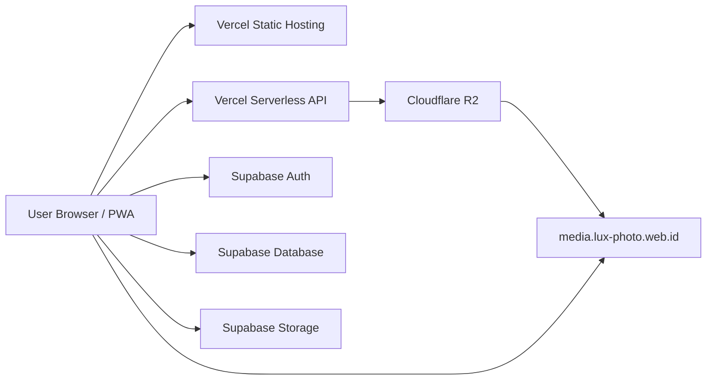
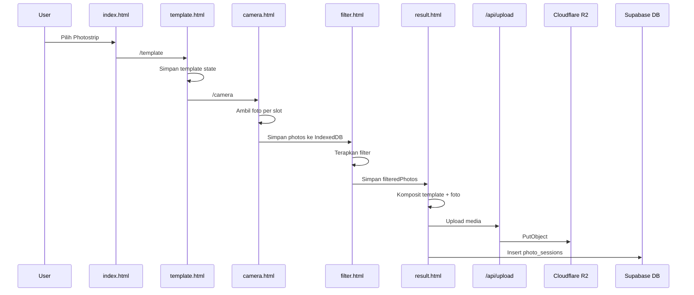
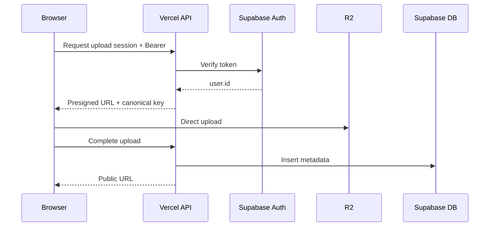

# LUX Photobooth — README Teknis dan Developer Handoff

> Dokumen ini adalah sumber onboarding utama untuk developer berikutnya.
>
> Snapshot kode yang diaudit: **18 Juli 2026**  
> Target deployment: **Vercel**  
> Backend data dan autentikasi: **Supabase**  
> Penyimpanan hasil foto baru: **Cloudflare R2**  
> Domain media publik: **`https://media.lux-photo.web.id`**

---

## 1. Ringkasan proyek

LUX Photobooth adalah aplikasi photobooth berbasis web dan PWA yang dibangun sebagai kumpulan halaman HTML statis dengan JavaScript langsung di browser. Aplikasi tidak menggunakan React, Vue, Angular, bundler, atau backend monolitik.

Arsitektur utamanya:

```text
Browser / PWA
├── HTML + CSS + JavaScript statis
├── Supabase Auth
├── Supabase PostgREST
├── Supabase Storage untuk aset owner, template, logo, welcome screen, dan file lama
├── IndexedDB untuk handoff foto besar antarhalaman
├── localStorage/sessionStorage untuk state alur
└── Vercel serverless API
    └── Cloudflare R2 untuk hasil foto baru
```

Produk utama yang tersedia:

1. Photostrip.
2. Photobox 4R.
3. Ganci Photo Insert.
4. Photobooth Kalender.
5. ID Card.
6. Magazine Cover.
7. Newspaper Cover.
8. Trading Card.
9. Certificate.
10. Game Character.
11. Detective Case File.
12. Icon Portrait, tetapi shortcut dari halaman index saat ini tidak aktif.
13. Event mode.
14. Galeri pengguna.
15. Template Manager.
16. CMS super admin.
17. Analytics.
18. Content Sharing dan consent.

Aplikasi memiliki dua kelas akun:

- **Free**: tetap dapat menggunakan alur utama, tetapi hasil diberi watermark proteksi LUX.
- **Pro**: hasil tidak menggunakan watermark proteksi dan dapat membuka fitur bisnis tertentu.
- **Inactive**: akses aplikasi diblokir.
- **Super admin**: ditentukan berdasarkan email yang dikonfigurasi.

---

## 2. Status dokumentasi dan sumber kebenaran

README lama hanya menjelaskan Template Text Editor dan tidak mencakup sebagian besar fitur saat ini.

Dokumen ini dibuat berdasarkan isi ZIP terbaru. Dokumen ini tidak menganggap infrastruktur live selalu identik dengan kode. Developer tetap harus memverifikasi:

- Environment Variables Vercel.
- Secrets Supabase Edge Functions.
- Schema database Supabase.
- RLS policies.
- Konfigurasi bucket Supabase Storage.
- Konfigurasi Cloudflare R2.
- CORS custom domain R2.
- Lifecycle rule R2.
- Domain dan redirect produksi.

Tidak ada satu file schema SQL kanonis yang membuat seluruh database dari nol. Folder proyek berisi beberapa migration/hotfix SQL bertahap. Untuk deployment baru, developer harus menggabungkan migration tersebut menjadi schema dasar yang terdokumentasi.

---

## 3. Karakteristik teknis penting

### 3.1 Tidak ada build frontend

Frontend dilayani sebagai file statis.

Konsekuensi:

- Perubahan HTML/JS langsung memengaruhi production setelah deploy.
- Tidak ada type checking otomatis.
- Tidak ada bundling atau tree shaking.
- Banyak JavaScript berada inline di file HTML.
- Global variable dan global function menjadi kontrak antarbagian halaman.
- Kesalahan sintaks satu blok script dapat menghentikan seluruh halaman.

### 3.2 Navigasi adalah multi-page navigation

Contoh:

```text
/index
  → /template
  → /camera
  → /filter
  → /result
```

Data tidak diteruskan lewat object JavaScript hidup, karena setiap navigasi membuat document baru. State diteruskan lewat:

- `localStorage`.
- `sessionStorage`.
- `IndexedDB`.
- query string.
- Supabase.
- Cloudflare R2.

### 3.3 Browser state adalah bagian dari arsitektur

State browser bukan sekadar cache. Banyak alur tidak dapat bekerja tanpa key yang tepat.

Contoh:

```text
template.html
  menyimpan templateSrc, templateSlots, slotCount

camera.html
  membaca templateSlots dan slotCount
  menyimpan photos dan livePhotos

filter.html
  membaca photos
  menyimpan filteredPhotos

result.html
  membaca filteredPhotos, templateSrc, templateSlots
```

Karena itu, perubahan nama key harus dianggap sebagai breaking change.

### 3.4 PWA dan Service Worker

`sw.js` melakukan precache file utama dan menggunakan:

- `networkFirst` untuk navigation.
- `networkFirst` untuk `auth.js`, `config.js`, `index.html`, `login.html`, dan `template.html`.
- `cacheFirst` untuk aset same-origin lain.
- fallback clean route ke file HTML yang sesuai.

Setiap perubahan penting pada file yang di-cache wajib diikuti dengan perubahan `CACHE_NAME`.

Jika `CACHE_NAME` tidak dinaikkan, user dapat menjalankan kombinasi file lama dan baru.

---

## 4. Arsitektur deployment



### Tanggung jawab Vercel

- Menyajikan seluruh HTML, JS, CSS inline, ikon, manifest, dan aset.
- Menyediakan clean URL melalui rewrites.
- Menjalankan `/api/upload`.
- Menjalankan `/api/cleanup`.
- Menjalankan `/api/admin-create-user`.
- Menjalankan cron harian `/api/cleanup`.

### Tanggung jawab Supabase

- Login email/password.
- Refresh token dan session.
- Profile owner.
- Template custom.
- Metadata foto.
- Event.
- Consent.
- Analytics.
- Content sharing settings.
- Pro extension logs.
- ID Card history opsional.
- Penyimpanan template, logo, event welcome, dan hasil lama.

### Tanggung jawab Cloudflare R2

- Menyimpan output hasil baru.
- Menyajikan hasil melalui custom domain.
- Menyediakan CORS untuk fetch/share/download.
- Idealnya menjalankan lifecycle deletion 14 hari untuk prefix `results/`.

---

## 5. Stack teknologi

### Frontend

- HTML5.
- CSS3.
- Vanilla JavaScript.
- Canvas 2D.
- MediaDevices API.
- MediaRecorder API.
- IndexedDB.
- localStorage.
- sessionStorage.
- Service Worker.
- Web App Manifest.
- Web Share API.
- Web Print.
- QRCode.js dari CDN.
- JSZip dari CDN.
- MediaPipe pada halaman filter.

### Backend dan storage

- Vercel static hosting.
- Vercel serverless functions.
- Vercel cron.
- Supabase Auth.
- Supabase PostgREST.
- Supabase Storage.
- Supabase Edge Functions.
- PostgreSQL dan RLS.
- Cloudflare R2.
- AWS SDK S3 client untuk R2.

### Runtime minimum

`package.json` menyatakan:

```json
{
  "engines": {
    "node": ">=20"
  }
}
```

Node.js dipakai untuk fungsi serverless dan package `@aws-sdk/client-s3`.

---

## 6. Struktur repository

### File inti

| File | Peran |
|---|---|
| `index.html` | Dashboard utama dan pemilih produk. |
| `login.html` | Login email/password Supabase. |
| `reset-password.html` | Recovery dan perubahan password dari email recovery. |
| `config.js` | Konfigurasi publik browser. |
| `config.example.js` | Contoh konfigurasi browser. |
| `auth.js` | Session, account lock, guarded fetch, profile, plan, watermark. |
| `template.html` | Katalog template built-in dan custom untuk Photostrip/Photobox. |
| `camera.html` | Kamera utama, timer, auto/manual, zoom, retake, handoff foto. |
| `filter.html` | Beauty filter, tone, flip, brightness, smoothing, lip, blush. |
| `result.html` | Komposit final, upload, download, share, print, GIF, QR, consent. |
| `gallery.html` | Galeri sesi, filter produk, preview, print, QR, delete. |
| `download.html` | Landing publik hasil scan QR. |
| `admin.html` | Profile owner dan Template Manager. |
| `cms.html` | Pengelolaan akun oleh super admin. |
| `event.html` | CRUD event dan pemilihan template event. |
| `event-run.html` | Welcome screen dan pemilihan produk event. |
| `analytics.html` | Ringkasan analytics dan export CSV. |
| `content-sharing.html` | Pengaturan consent dan monitoring consent. |
| `sw.js` | Service Worker dan offline cache. |
| `manifest.json` | Metadata PWA. |
| `vercel.json` | Headers, cron, dan clean URL rewrites. |
| `package.json` | Metadata Node dan dependency serverless. |

### Modul produk tambahan

| File | Peran |
|---|---|
| `ganci.html` | Konfigurasi dan preview produk ganci. |
| `ganci-utils.js` | Generator frame ganci. |
| `ganci-print.js` | Sheet cetak ganci dan logo panel. |
| `kalender.html` | Kalender bulanan/tahunan siap cetak. |
| `idcard.html` | Generator ID Card dan history lokal/database. |
| `product-photobooth.js` | Rendering trading card, certificate, game, detective, icon. |
| `cover-maker.js` | Rendering Magazine dan Newspaper. |
| `local-camera.js` | Modal kamera lokal untuk produk non-flow utama. |
| `beautify.js` | Helper beautification produk tertentu. |
| `certificate.html` | UI certificate. |
| `trading-card.html` | UI trading card. |
| `game-character.html` | UI game character. |
| `detective-case.html` | UI detective case. |
| `icon-portrait.html` | UI icon portrait. |
| `magazine.html` | UI magazine cover. |
| `newspaper.html` | UI newspaper cover. |

### Serverless dan Edge Functions

| File | Peran |
|---|---|
| `api/upload.js` | Upload base64 ke Cloudflare R2. |
| `api/cleanup.js` | Cleanup file lama di Supabase Storage. |
| `api/admin-create-user.js` | Membuat Supabase Auth user dan profile melalui service role. |
| `supabase/admin-toggle-active/index.ts` | Aktif/nonaktif akun dari CMS. |
| `supabase/functions/admin-change-password/index.ts` | Ganti password user lain dari CMS. |

---

## 7. Routing Vercel

Clean route dipetakan ke file HTML melalui `vercel.json`.

| URL | File |
|---|---|
| `/` | `index.html` |
| `/login` | `login.html` |
| `/reset-password` | `reset-password.html` |
| `/template` | `template.html` |
| `/camera` | `camera.html` |
| `/filter` | `filter.html` |
| `/result` | `result.html` |
| `/preview` | `preview.html` |
| `/download` | `download.html` |
| `/gallery` | `gallery.html` |
| `/admin` | `admin.html` |
| `/cms` | `cms.html` |
| `/tutorial` | `tutorial.html` |
| `/analytics` | `analytics.html` |
| `/content-sharing` | `content-sharing.html` |
| `/event` | `event.html` |
| `/event-run` | `event-run.html` |
| `/ganci` | `ganci.html` |
| `/kalender` | `kalender.html` |
| `/idcard` | `idcard.html` |
| `/icon-portrait` | `icon-portrait.html` |
| `/game-character` | `game-character.html` |
| `/certificate` | `certificate.html` |
| `/trading-card` | `trading-card.html` |
| `/detective-case` | `detective-case.html` |
| `/newspaper` | `newspaper.html` |
| `/magazine` | `magazine.html` |

Catatan:

- `index.html` memiliki fungsi `bukaIconPortrait()` yang saat ini hanya `return`, sehingga halaman Icon Portrait tidak terbuka dari shortcut index.
- Route tetap tersedia langsung.
- Jika menambah halaman baru, update minimal:
  1. `vercel.json`.
  2. `sw.js` `CORE_ASSETS`.
  3. `sw.js` `CLEAN_ROUTE_FALLBACKS`.
  4. Navigation UI.
  5. README.

---

## 8. Konfigurasi browser

`config.js` dieksekusi di browser dan boleh berisi nilai publik.

Kontrak saat ini:

```js
window.LUX_CONFIG = Object.freeze({
  SUPABASE_URL: 'https://PROJECT.supabase.co',
  SUPABASE_ANON_KEY: 'PUBLIC_ANON_KEY',
  SUPER_ADMIN_EMAIL: 'admin@example.com',
  STORAGE_BUCKET: 'photobooth',
  R2_PUBLIC_URL: 'https://media.example.com',
  APP_VERSION: 'version-string'
});
```

### Aman berada di browser

- Supabase project URL.
- Supabase anon key.
- Public bucket name.
- Public R2 media URL.
- Super admin email sebagai identifier UI.

### Dilarang berada di browser

- Supabase service role key.
- R2 secret access key.
- R2 access key ID.
- CRON secret.
- Database password.
- JWT secret.
- Cloudflare API token dengan write permission.

### Gap konfigurasi saat ini

`config.example.js` belum mencantumkan `R2_PUBLIC_URL`, sedangkan `config.js` sudah memakainya. Developer harus menambahkan field tersebut ke example agar deployment baru tidak kembali ke domain `r2.dev` atau fallback.

---

## 9. Environment Variables Vercel

### Wajib untuk upload R2

```text
R2_ENDPOINT
R2_ACCESS_KEY_ID
R2_SECRET_ACCESS_KEY
R2_BUCKET
R2_PUBLIC_URL
```

Contoh bentuk:

```text
R2_ENDPOINT=https://<account-id>.r2.cloudflarestorage.com
R2_BUCKET=photobooth-storage
R2_PUBLIC_URL=https://media.lux-photo.web.id
```

### Wajib untuk fungsi admin

```text
SUPABASE_URL
SUPABASE_SERVICE_ROLE_KEY
SUPER_ADMIN_EMAIL
```

### Disarankan untuk cleanup

```text
SUPABASE_URL
SUPABASE_SERVICE_ROLE_KEY
SUPABASE_BUCKET
RETENTION_DAYS
CRON_SECRET
```

### Optional/fallback

```text
SUPABASE_ANON_KEY
```

`SUPABASE_ANON_KEY` tidak boleh dipakai sebagai pengganti service role untuk operasi cleanup production karena RLS/storage policy dapat menolak operasi atau membuat cakupan tidak sesuai.

---

## 10. Autentikasi dan integritas akun

### 10.1 Halaman publik

`auth.js` mengecualikan:

```text
/login
/login.html
/reset-password
/reset-password.html
```

Halaman lain yang memuat `auth.js` otomatis dianggap protected.

### 10.2 Key autentikasi

```text
localStorage:
sb_session
sb_user_id
sb_user_email
sb_profile
sb_account_lock

sessionStorage:
lux_flow_owner_id
```

### 10.3 Account lock

Tujuannya memastikan akun yang pertama login tetap sama sepanjang flow.

Validasi membandingkan:

1. `session.user.id`.
2. `sub` pada JWT access token.
3. `sb_user_id`.
4. `sb_account_lock`.
5. `lux_flow_owner_id`.

Jika salah satu berbeda, aplikasi melakukan security logout.

### 10.4 Login

`login.html`:

1. Memanggil Supabase `/auth/v1/token?grant_type=password`.
2. Memverifikasi `token.sub === data.user.id`.
3. Memeriksa lock akun lama.
4. Menyimpan session.
5. Memuat profile.
6. Menghormati query `next`.
7. Redirect ke `/` jika `next` tidak valid.

### 10.5 Session refresh

`auth.js` merefresh session jika token akan kedaluwarsa dalam 120 detik.

Endpoint:

```text
POST /auth/v1/token?grant_type=refresh_token
```

Session hasil refresh wajib memiliki UUID akun yang sama.

### 10.6 Server verification

`Auth.ensureValidSession({ forceServerCheck: true })` memanggil:

```text
GET /auth/v1/user
```

Jika jaringan gagal tetapi token lokal belum expired dan identitas konsisten, aplikasi masuk status `offline-valid`.

### 10.7 Guarded fetch

`auth.js` membungkus `window.fetch`.

Request yang dijaga:

- Supabase selain token endpoint.
- `/api/*` same-origin.

Wrapper:

- Menunggu `Auth.ready`.
- Memastikan `Auth.requireAuth()`.
- Menambahkan Bearer access token jika belum ada.
- Menambahkan Supabase anon key untuk request Supabase.

Penting:

- Guarded fetch hanya proteksi browser.
- Serverless API tetap harus memverifikasi token sendiri.
- Client guard dapat dilewati dengan request eksternal.

### 10.8 Sinkronisasi lintas tab

Mekanisme:

- `storage` event.
- `BroadcastChannel('lux-auth')`.
- validasi saat `pageshow`.
- validasi saat tab kembali visible.
- validasi setiap 120 detik.

### 10.9 Branding profile

Setelah auth siap:

- `[data-auth-logo]` diganti dengan logo profile.
- `[data-auth-boothname]` diganti dengan nama booth.
- beberapa judul/footer lama diganti otomatis.
- `document.title` yang memuat `LUX Photobooth` dapat diganti nama booth.

---

## 11. Plan, akses, dan watermark

Profile diharapkan memiliki:

```text
plan
pro_ends_at
is_active
show_watermark
```

Status:

```text
pro       plan=pro dan pro_ends_at belum lewat
free      selain pro, selama akun aktif
inactive  is_active=false
```

Free tetap boleh memakai fitur utama.

Watermark proteksi Free:

```text
PROPERTI OF LUX PHOTOBOOTH
```

`Auth.drawProWatermark()` menggambar watermark tiled diagonal.

Super admin tidak terkena watermark Free.

Catatan:

- Ada dua konsep watermark:
  1. Watermark/booth name profile.
  2. Proteksi Free milik LUX.
- Jangan mencampur kedua konsep saat refactor.

---

## 12. Alur utama Photostrip



### State dari template

`template.html` menyimpan:

```text
templateSrc
templateSlots
templateTextElements
templateName
templateCategory
templateId
templateW
templateH
templateIsBasic
templatePhotoLayer
templateProduct
slotCount
```

### Handoff kamera

`camera.html` menyimpan foto besar ke IndexedDB.

Key utama:

```text
photos:<photoSessionId>
filteredPhotos
livePhotos
```

Marker/fallback:

```text
photosStore
filteredPhotosStore
livePhotosStore
photosSessionId
luxPhotoSessionId
```

### Handoff filter

URL:

```text
/filter?photoSession=<uuid>&handoff=2
```

Filter mencari:

```text
photos:<photoSessionId>
photos
localStorage photos
```

### Handoff result

Filter menyimpan:

```text
filteredPhotos
livePhotos
```

Result memprioritaskan `filteredPhotos`, lalu fallback ke `photos`.

---

## 13. Alur langsung Camera ke Result

Camera memiliki tiga pilihan setelah semua foto selesai:

```text
Retake Foto
Edit Filter
Langsung ke Hasil
```

Jalur langsung:

1. Validasi login.
2. Memastikan semua slot terisi.
3. Menyimpan foto mentah sebagai `filteredPhotos`.
4. Menyimpan `livePhotos` bila tersedia.
5. Menandai `filterSkipped=1`.
6. Redirect ke:

```text
/result?source=camera&filter=skipped
```

Secara konsep, foto mentah diperlakukan sebagai filter `Normal`.

Jalur langsung hanya ditampilkan untuk:

- Photostrip.
- Photobox.

Tidak ditampilkan untuk:

- Ganci.
- Product flow.

---

## 14. Photobox 4R

Photobox menggunakan flow teknis yang sama dengan Photostrip, tetapi:

- `captureFlow='photobox'`.
- `templateProduct='photobox'`.
- canvas template biasanya `1181 × 1772`.
- output diarahkan sebagai 10×15/4R.
- pilihan cetak/share 2 strip disembunyikan di result.
- built-in template memakai 4–6 slot.
- layout slot dibuat menyebar seimbang secara vertikal.
- wording mengikuti keluarga desain Photostrip.
- kategori Social Media memiliki footer card khusus.

Photobox built-in dibuat runtime melalui Canvas dan tidak wajib memiliki row database.

---

## 15. Template system

### 15.1 Jenis template

```text
Built-in global
Custom per user
Event-selected
Photostrip
Photobox
Basic color frame
```

### 15.2 Built-in template

Built-in template berada di `template.html`.

Karakteristik:

- Dibuat runtime dengan Canvas.
- Memiliki definisi warna, motif, kategori, dan wording.
- Area foto dibuat transparan.
- Preview dapat memakai resolusi ringan.
- Full-resolution dibuat saat dipilih.
- Tidak membutuhkan row pada tabel `templates`.

### 15.3 Kategori built-in utama

Termasuk:

- Korean.
- Film.
- Elegant, walaupun dapat disembunyikan dari kategori tertentu.
- Floral.
- Seasonal.
- Gaming.
- Pattern.
- Social Media.
- kategori tambahan dari template user.

### 15.4 Custom template

Admin mengupload image ke Supabase Storage:

```text
templates/{userId}/{timestamp}_{safeName}.png
templates/{userId}/{timestamp}_{safeName}_thumb.jpg
```

Row database menyimpan:

```json
{
  "user_id": "uuid",
  "name": "Template Name",
  "category": "Theme",
  "product_type": "photostrip | photobox",
  "photo_layer": "behind | front",
  "src": "public storage URL",
  "slots": [],
  "w": 591,
  "h": 1772
}
```

### 15.5 Slot dan text element

Kolom `slots` dipakai untuk dua tipe object.

Photo slot:

```json
{
  "x": 0,
  "y": 0,
  "w": 100,
  "h": 100,
  "r": 0
}
```

Text element:

```json
{
  "type": "text",
  "text": "PHOTOBOOTH",
  "x": 0,
  "y": 0,
  "w": 240,
  "h": 60,
  "r": 0,
  "font": "Segoe UI",
  "color": "#1D3557",
  "font_size": 36,
  "weight": 900
}
```

Text element disimpan di array `slots` untuk kompatibilitas schema lama.

### 15.6 Photo layer

```text
behind  foto dirender dahulu, template menimpa di depan
front   template dirender dahulu, foto diletakkan di depan
```

Gunakan `behind` jika template PNG memiliki lubang transparan.

Gunakan `front` jika template berfungsi sebagai background.

---

## 16. Camera

### 16.1 Device selection

Camera menggunakan:

```text
navigator.mediaDevices.getUserMedia
navigator.mediaDevices.enumerateDevices
devicechange
```

Pilihan device disimpan:

```text
selectedCameraId
```

Constraint ideal:

```text
1920 × 1440
aspect ratio 4:3
```

Jika device pilihan gagal, camera fallback ke default front camera.

### 16.2 Timer

Pilihan:

```text
3 detik
5 detik
10 detik
```

### 16.3 Mode capture

Manual:

```text
klik Ambil untuk setiap foto
```

Otomatis:

```text
foto pertama tetap dimulai dengan klik
foto kedua dan seterusnya menjalankan timer otomatis
```

### 16.4 Zoom

Pilihan:

```text
Normal = 1.0
120%   = 1.2
150%   = 1.5
200%   = 2.0
```

State:

```text
cameraZoomFactor
cameraZoomEnabled
```

`cameraZoomEnabled` dipertahankan untuk kompatibilitas versi lama.

Preview dan capture menggunakan faktor yang sama.

Capture zoom menggunakan center crop:

```js
cropW = videoWidth / cameraZoomFactor
cropH = videoHeight / cameraZoomFactor
```

### 16.5 Preview dan retake

Setelah seluruh slot selesai:

- preview besar.
- thumbnail seluruh foto.
- Retake.
- Edit Filter.
- Langsung ke Hasil.

### 16.6 Live photo

`MediaRecorder` merekam potongan video per slot.

Preference MIME:

```text
video/webm;codecs=vp8
video/webm
video/mp4
```

Bitrate:

```text
900000 bps
```

Live photo bersifat opsional. Kegagalan merekam live tidak membatalkan foto JPG.

### 16.7 Guard save

Sebelum handoff, Camera memanggil:

```js
window.LUX_REQUIRE_AUTH(...)
```

Tujuannya mencegah foto diteruskan jika session hilang atau akun berubah.

---

## 17. IndexedDB dan fallback foto besar

Database browser:

```text
DB: lux-photo-temp-db
Store: items
Version: 1
```

Strategi:

1. Simpan array besar di IndexedDB.
2. Baca ulang untuk verifikasi.
3. Hapus salinan besar dari localStorage.
4. Simpan marker `*Store='indexedDB'`.
5. Jika IndexedDB gagal, fallback ke localStorage JSON.

Kelemahan fallback:

- Data URL sangat besar.
- localStorage umumnya terbatas sekitar beberapa MB.
- Multi-slot dan live video dapat cepat memenuhi quota.
- Jangan menjadikan localStorage sebagai storage utama foto besar.

---

## 18. Filter

### 18.1 Tone

Pilihan:

- Normal.
- B&W.
- Sepia.
- Vintage.
- Cool.
- Warm.
- Fade.
- Drama.
- Matte.
- Moody.
- Dreamy.
- Teal & Orange.
- Kodak.
- Fuji.
- Lomo.
- Milk.

### 18.2 Transform

- Normal.
- Horizontal flip.

### 18.3 Face brightness

- Off.
- Natural.
- Medium.
- Bright.

### 18.4 Skin smoothing

- Off.
- Soft.
- Medium.
- Smooth.

Smoothing memakai multi-pass canvas dan mask wajah.

### 18.5 Lip tint

Tersedia beberapa warna:

- pink.
- red.
- coral.
- nude.
- rose.
- berry.
- plum.
- mauve.
- dusty rose.

### 18.6 Blush

Blush menggunakan color swatch dan posisi wajah.

### 18.7 Per-photo state

Filter menyimpan state per foto.

Format normal:

```json
{
  "tone": "normal",
  "brightness": 0,
  "smooth": 0,
  "lip": "off",
  "blush": "off",
  "flip": false
}
```

Filter dapat:

- berpindah foto.
- copy setting ke semua foto.
- reset foto.
- menyimpan hasil seluruh foto.

### 18.8 Product-specific flow

- Ganci: hasil filter disimpan ke `ganciState`, lalu redirect `/ganci?done=1`.
- Product: hasil satu foto disimpan ke `productPhoto`, lalu kembali ke `captureReturnUrl`.
- Photobox: mempertahankan `captureFlow='photobox'`.
- Default: redirect `/result`.

---

## 19. Result compositing

### 19.1 Urutan render

Secara umum:

```text
fill background putih
load template
render template bila photo_layer=front
render foto ke setiap slot dengan cover crop
render template bila photo_layer=behind
render text elements
render booth watermark bila diperlukan
render Free tiled watermark bila diperlukan
export JPEG
```

### 19.2 Cover crop

Untuk setiap slot:

```js
scale = max(slot.w / photo.width, slot.h / photo.height)
```

Hasil mempertahankan slot penuh tanpa letterbox.

### 19.3 Output

- JPG final.
- Live photo.
- GIF animasi.
- ZIP.
- 1 strip print.
- 2 strip print.
- 1 strip share.
- 2 strip share.
- QR download page.

### 19.4 UI result terbaru

UI diringkas menjadi:

```text
Download Satuan
├── Download Foto
└── Pilihan lainnya
    ├── Live Fotostrip
    ├── GIF Animasi
    └── ZIP

Print / Cetak
├── selector 1 Strip / 2 Strip
└── Cetak Sekarang

Share / Bagikan
├── selector 1 Strip / 2 Strip
├── Share Sekarang
└── Scan QR

Foto Lagi
```

Fungsi lama dipertahankan melalui hidden compatibility buttons karena beberapa bagian kode masih mencari ID lama.

### 19.5 GIF

`result.html` memiliki encoder GIF internal, termasuk:

- frame generation.
- median cut palette.
- dithering.
- nearest color.
- LZW encoding.

Ini kompleks dan rawan regresi. Jangan refactor tanpa test file hasil di beberapa browser.

### 19.6 ZIP

ZIP dibuat dengan JSZip dan dapat memuat:

- final JPG.
- live file.
- GIF.
- file individual.

### 19.7 Print

Print memakai popup/window HTML terpisah dan layout 10×15.

Browser dapat memblokir popup jika fungsi dipanggil setelah terlalu banyak proses async. Pertahankan hubungan dengan user click.

---

## 20. Upload hasil ke Cloudflare R2

### 20.1 Object naming

Format saat ini:

```text
results/{userId}_{sessionTimestamp}_{filename}
```

Contoh:

```text
results/<uuid>_1784289370184_strip.jpg
results/<uuid>_1784289370184_thumb.jpg
results/<uuid>_1784289370184_foto-1.jpg
results/<uuid>_1784289370184_animated.gif
results/<uuid>_1784289370184_live.webm
results/<uuid>_1784289370184_download-manifest.json
```

### 20.2 Upload transport

Browser:

1. Blob → ArrayBuffer.
2. ArrayBuffer → binary string.
3. Binary string → base64.
4. POST `/api/upload`.

Server:

1. Base64 → Buffer.
2. `PutObjectCommand` ke R2.
3. Return public URL.

Base64 menambah ukuran request sekitar 33%. Untuk file besar, pendekatan presigned URL lebih efisien.

### 20.3 Public URL

Gunakan:

```text
https://media.lux-photo.web.id
```

Jangan meng-hardcode domain `pub-*.r2.dev`.

### 20.4 Manifest QR

Manifest berisi:

```json
{
  "version": 1,
  "type": "photostrip | photobox",
  "ownerId": "uuid",
  "eventId": "uuid-or-empty",
  "photo": "final URL",
  "photos": ["individual URL"],
  "gif": "gif URL",
  "createdAt": "ISO timestamp"
}
```

QR mengarah ke:

```text
https://www.lux-photo.web.id/download.html?m=<manifest-url>&owner=<uuid>
```

---

## 21. Hybrid storage dan tanggal migrasi

Galeri memakai pemilihan storage berdasarkan tanggal file.

Cutover:

```text
17 Juli 2026 00:00:00 WIB
16 Juli 2026 17:00:00 UTC
```

Konstanta:

```js
Date.parse('2026-07-16T17:00:00.000Z')
```

Aturan:

```text
timestamp < cutover
  → Supabase Storage public URL

timestamp >= cutover
  → Cloudflare R2 custom domain
```

Sumber timestamp utama adalah nama file.

Fallback adalah `created_at`.

Jangan mengubah timestamp cutoff tanpa migration data.

---

## 22. Galeri

### 22.1 Re-authentication

Galeri meminta password login kembali.

Alur:

1. Ambil email session aktif.
2. Sign in password ke Supabase.
3. Pastikan UUID hasil sign in sama dengan UUID session aktif.
4. Normalisasi account lock.
5. Refresh profile.
6. Load metadata.

### 22.2 Data source

Galeri membaca tabel:

```text
photo_sessions
```

Field yang dibaca:

```text
file_path
product_type
template_name
template_category
created_at
session_id
```

### 22.3 Grouping

Sesi dikelompokkan berdasarkan timestamp 13 digit pada nama file.

File dikenali:

```text
strip*
foto.*
foto-*
animated*
```

### 22.4 Fitur

- Grid sesi.
- Filter Photostrip/Photobox.
- Load more.
- Detail strip.
- Individual photo.
- GIF.
- Download.
- Share.
- QR.
- Multi-select print.
- Delete.
- Re-auth password.

### 22.5 Delete saat ini

Delete masih memanggil:

```text
DELETE Supabase Storage /storage/v1/object/photobooth
```

Masalah:

- File R2 tidak terhapus.
- Row `photo_sessions` tidak dihapus.
- UI dapat menghilangkan sesi walaupun object R2 tetap ada.
- Perlu endpoint server-side R2 delete dan metadata transaction.

Lihat bagian Technical Debt Prioritas Tinggi.

---

## 23. Download page

`download.html` adalah landing publik QR.

Sumber data:

- manifest URL parameter `m`.
- fallback `photo`, `p`, dan `gif`.
- owner UUID.

Fitur:

- display final photo.
- display individual photo.
- download JPG.
- download individual.
- download semua individual.
- download GIF.
- share.
- countdown.
- consent publik jika aktif.

Karena halaman publik tidak memakai session owner, RLS dan policy consent harus dirancang hati-hati.

---

## 24. Consent dan Content Sharing

### 24.1 Settings

Table:

```text
content_sharing_settings
```

Field:

```text
user_id
enabled
instagram_brand
tiktok_brand
consent_message
follow_message
theme
updated_at
```

### 24.2 Consent data

Table:

```text
photo_consents
```

Field:

```text
id
user_id
photo_session_id
session_id
event_id
publish_consent
tag_consent
instagram_username
tiktok_username
final_photo_url
created_at
```

### 24.3 Consent points

Consent dapat diminta:

- di Result sebelum action.
- di download page publik.

### 24.4 Owner monitoring

`content-sharing.html`:

- aktif/nonaktif consent.
- brand Instagram/TikTok.
- pesan consent.
- follow message.
- filter consent.
- statistik.
- tabel.
- export CSV.

### 24.5 Policy warning

Migration saat ini memiliki public insert yang sangat permisif untuk `photo_consents`.

Developer harus menilai risiko:

- spoofed `user_id`.
- spam insert.
- invalid event/session.
- malicious URL.
- analytics pollution.

Idealnya gunakan server endpoint atau signed manifest token.

---

## 25. Analytics

Data source:

```text
analytics_sessions_view
photo_consents
lux_events
```

Fitur:

- session count.
- event breakdown.
- template breakdown.
- product type breakdown.
- consent statistics.
- filter tanggal.
- export CSV.

Penting:

`photo_sessions` hasil upload terbaru saat ini hanya diinsert dengan:

```text
user_id
file_path
created_at
```

Field analytics seperti berikut dapat kosong:

```text
event_id
template_id
product_type
photo_count
session_duration
session_id
template_name
template_category
```

Akibatnya analytics dan filter galeri tidak selalu lengkap.

---

## 26. Event mode

### 26.1 Event table

`lux_events` menyimpan:

```text
id
user_id
name
welcome_screen_url
welcome_overlay_enabled
template_ids
product_types
is_active
created_at
updated_at
```

### 26.2 Event setup

`event.html`:

- create event.
- edit event.
- delete event.
- pilih template.
- select all template.
- pilih product type.
- upload welcome screen.
- start event.

### 26.3 Welcome screen storage

Path:

```text
templates/event-welcome/{userId}/{timestamp}_{filename}
```

Jika upload Storage gagal, code fallback menyimpan data URL ke kolom `welcome_screen_url`.

Risiko fallback:

- row database membesar.
- egress PostgREST meningkat.
- payload event membengkak.
- browser memory meningkat.

### 26.4 Event runtime state

Key event disimpan pada sessionStorage/localStorage:

```text
eventMode
activeEvent
activeEventId
activeEventTemplateIds
activeEventName
activeEventWelcomeURL
activeEventWelcomeOverlay
activeEventProductType
```

`event-run.html` menyajikan welcome screen dan mengarahkan ke template sesuai produk.

---

## 27. Admin dan Template Manager

### 27.1 Profile

Admin dapat mengubah:

```text
booth_name
email
whatsapp_number
logo_url
show_watermark
```

Logo disimpan:

```text
logos/{userId}/logo.{ext}
```

### 27.2 Template Manager

Fitur:

- upload PNG.
- pilih Photostrip/Photobox.
- kategori.
- auto detect slot.
- tambah slot manual.
- drag.
- resize.
- rotate.
- duplicate.
- delete.
- photo layer.
- tambah text element.
- edit text.
- pilih font.
- pilih warna.
- rotate text.
- duplicate text.
- delete text.
- thumbnail.
- save cloud.
- delete template.

### 27.3 Re-auth

Bagian sensitif Admin dapat meminta password dan memperbarui session hanya jika UUID tetap sama.

### 27.4 Deleted template local list

`pb_deleted_template_ids` disimpan di localStorage.

Ini hanya suppression lokal, bukan sumber data authoritative. Jika delete database/storage gagal tetapi ID dimasukkan lokal, template dapat hilang hanya pada browser tertentu.

---

## 28. CMS super admin

### Fitur

- daftar profiles.
- statistik plan.
- search/filter.
- create account.
- active/inactive.
- Free.
- activate/extend Pro.
- change password.
- generate receipt.
- PDF receipt.
- copy receipt.
- log perpanjangan.

### Server operations

#### Create account

```text
POST /api/admin-create-user
```

Wajib Bearer token super admin.

Server:

1. Verifikasi requester `/auth/v1/user`.
2. Cocokkan email.
3. Create Auth user.
4. Upsert profile.
5. Rollback Auth user jika profile gagal.

#### Toggle active

```text
POST /functions/v1/admin-toggle-active
```

#### Change password

```text
POST /functions/v1/admin-change-password
```

### Super admin coupling

Email super admin muncul di:

- `config.js`.
- `auth.js`.
- `cms.html`.
- serverless env.
- Edge Function env.
- policy SQL `pro_extension_logs`.

Mengubah email harus dilakukan di seluruh lokasi tersebut.

---

## 29. Produk Ganci

Flow:

```text
/ganci
  → configure
  → /camera dengan captureFlow=ganci
  → /filter
  → /ganci?done=1
  → generate sheet
```

State:

```text
ganciConfig
ganciState
```

Fitur:

- bentuk.
- frame.
- corner style.
- paper size.
- quantity.
- beautify.
- retake.
- print sheet.
- logo panel.
- local gallery.

Frame generator berada di `ganci-utils.js`.

Print sheet berada di `ganci-print.js`.

---

## 30. Kalender

Fitur:

- yearly/monthly.
- portrait/landscape.
- theme.
- upload/camera photo.
- filter foto.
- holiday file `holidays/2026.json`.
- holiday notes.
- decorations.
- download.
- share.
- print-ready output.

Kalender merupakan flow mandiri dan tidak bergantung pada `template.html`.

---

## 31. ID Card

Fitur:

- nickname.
- ID number.
- role.
- mood.
- fun fact.
- language.
- theme.
- filter.
- beautify.
- camera/upload.
- export.
- print.
- history.
- optional database sync.

SQL opsional:

```text
idcards.sql
```

---

## 32. Product Photobooth dan Cover Maker

`product-photobooth.js` dipakai oleh:

- Trading Card.
- Certificate.
- Game Character.
- Detective Case.
- Icon Portrait.

`cover-maker.js` dipakai oleh:

- Magazine.
- Newspaper.

Product camera flow:

```text
product page
  set captureFlow=product
  set captureReturnUrl
  → camera
  → filter
  save productPhoto
  → kembali ke product page
```

---

## 33. Supabase database objects

### 33.1 `profiles`

Code mengharapkan setidaknya:

```text
id uuid
booth_name text
email text
whatsapp_number text
logo_url text
show_watermark boolean
plan text
pro_ends_at timestamptz
is_active boolean
created_at timestamptz
updated_at timestamptz
```

Tidak ada canonical create table `profiles` lengkap di snapshot.

### 33.2 `templates`

Code mengharapkan:

```text
id
user_id
name
category
product_type
photo_layer
src
slots json/jsonb
w
h
created_at
updated_at
```

### 33.3 `photo_sessions`

Code dan migrations mengharapkan:

```text
id
user_id
file_path
created_at
event_id
template_id
product_type
photo_count
session_duration
session_id
template_name
template_category
```

### 33.4 `lux_events`

Lihat bagian Event.

### 33.5 `content_sharing_settings`

Lihat bagian Consent.

### 33.6 `photo_consents`

Lihat bagian Consent.

### 33.7 `pro_extension_logs`

Menyimpan audit aktivasi/perpanjangan Pro.

### 33.8 `id_cards`

Opsional untuk history ID Card.

### 33.9 `analytics_sessions_view`

View join:

```text
photo_sessions
LEFT JOIN lux_events
```

---

## 34. RLS minimum

### `photo_sessions`

Policy yang disediakan:

```sql
select  auth.uid() = user_id
insert  auth.uid() = user_id
update  auth.uid() = user_id
delete  auth.uid() = user_id
```

### `lux_events`

Semua operasi own-user.

### `templates`

RLS dasar tidak didefinisikan lengkap di snapshot ini, tetapi aplikasi mengasumsikan user hanya dapat mengakses template miliknya. Wajib audit policy live.

### `profiles`

RLS dasar tidak didefinisikan lengkap di snapshot ini. Wajib audit.

### `content_sharing_settings`

- owner select/update.
- public select sengaja diaktifkan untuk download page.

### `photo_consents`

- owner select/update/delete.
- public insert saat ini terlalu permisif.

### `pro_extension_logs`

Policy bergantung pada email super admin pada JWT.

---

## 35. Supabase Storage

Bucket default:

```text
photobooth
```

Path:

```text
logos/{userId}/logo.ext
templates/{userId}/{timestamp}_{name}.png
templates/{userId}/{timestamp}_{name}_thumb.jpg
templates/event-welcome/{userId}/{timestamp}_{name}
results/...                           legacy
```

Bucket harus memiliki policy yang sesuai untuk:

- authenticated upload own folder.
- authenticated delete own object.
- public read untuk aset yang memang public.
- anon read jika link publik diperlukan.

Hindari policy global write.

---

## 36. Cloudflare R2

### Bucket

Environment menentukan nama bucket. Dashboard yang digunakan pada pengembangan sebelumnya memakai bucket seperti:

```text
photobooth-storage
```

### Custom domain

```text
media.lux-photo.web.id
```

Pastikan status Active pada R2 Custom Domains, bukan hanya CNAME manual.

### CORS

Contoh policy:

```json
[
  {
    "AllowedOrigins": [
      "https://www.lux-photo.web.id",
      "https://lux-photo.web.id"
    ],
    "AllowedMethods": [
      "GET",
      "HEAD"
    ],
    "AllowedHeaders": [
      "*"
    ],
    "ExposeHeaders": [
      "Content-Length",
      "Content-Type",
      "ETag"
    ],
    "MaxAgeSeconds": 3600
  }
]
```

Tambahkan domain Vercel preview jika testing dilakukan dari sana.

Tanpa CORS:

- `` mungkin tetap tampil.
- `fetch()` Blob gagal.
- share file gagal.
- canvas dengan image cross-origin dapat menjadi tainted.

### Lifecycle

Disarankan:

```text
prefix: results/
expire after: 14 days
```

Ini lebih andal daripada cron yang hanya menghapus Supabase Storage.

---

## 37. Vercel headers

`vercel.json` menonaktifkan cache untuk:

- login.
- template.
- index.
- auth.js.
- config.js.
- sw.js.

`result.html` diberi:

```text
Cross-Origin-Opener-Policy: same-origin
Cross-Origin-Embedder-Policy: require-corp
```

Karena result memuat CDN eksternal, developer harus memastikan CDN mengirim header CORS/CORP yang kompatibel. Jika QRCode.js atau JSZip gagal load setelah perubahan CDN, periksa COEP terlebih dahulu.

---

## 38. Local development

### Install

```bash
npm install
```

### Static-only preview

```bash
python3 -m http.server 4173
```

Buka:

```text
http://localhost:4173
```

Keterbatasan:

- `/api/upload` tidak tersedia.
- `/api/cleanup` tidak tersedia.
- `/api/admin-create-user` tidak tersedia.
- camera membutuhkan secure context pada beberapa browser; localhost biasanya dianggap secure.
- R2 upload result akan gagal jika API tidak dijalankan.

### Full Vercel emulation

Disarankan:

```bash
npx vercel dev
```

Pastikan Environment Variables tersedia.

### package scripts saat ini

`package.json` mendefinisikan:

```text
npm run validate
npm run serve
```

Namun snapshot tidak memiliki:

```text
scripts/validate_repo.py
```

Jadi `npm run validate` akan gagal sampai file tersebut dibuat kembali atau script package diubah.

README lama juga merujuk:

```text
docs/DEPLOYMENT.md
```

File tersebut tidak ada pada snapshot.

---

## 39. Deployment checklist

### Sebelum deploy

- [ ] Pastikan `config.js` benar.
- [ ] Jangan commit service role key.
- [ ] Pastikan R2 env lengkap.
- [ ] Pastikan Supabase service role env lengkap.
- [ ] Pastikan Edge Function secrets lengkap.
- [ ] Audit RLS.
- [ ] Audit Storage policies.
- [ ] Audit R2 CORS.
- [ ] Audit R2 lifecycle.
- [ ] Naikkan `CACHE_NAME` di `sw.js`.
- [ ] Update `APP_VERSION`.
- [ ] Jalankan smoke test.
- [ ] Periksa console error.
- [ ] Periksa Network request gagal.
- [ ] Periksa upload final dan metadata.
- [ ] Periksa galeri.
- [ ] Periksa QR.
- [ ] Periksa share 1/2 strip.
- [ ] Periksa print 1/2 strip.
- [ ] Periksa Free watermark.
- [ ] Periksa Pro tanpa watermark.
- [ ] Periksa event mode.
- [ ] Periksa Photobox.

### Deploy Vercel

```bash
vercel
vercel --prod
```

Atau push ke branch yang terhubung.

### Setelah deploy

- [ ] Hard refresh.
- [ ] Verifikasi Service Worker baru.
- [ ] Login akun test.
- [ ] Jalankan satu sesi Photostrip.
- [ ] Jalankan satu sesi Photobox.
- [ ] Cek object R2.
- [ ] Cek row `photo_sessions`.
- [ ] Cek galeri.
- [ ] Scan QR dari device lain.
- [ ] Cek CORS.
- [ ] Cek download.
- [ ] Cek share.
- [ ] Cek print.
- [ ] Cek logout lintas tab.

---

## 40. Service Worker deployment discipline

Setiap perubahan pada file cache-first:

```js
const CACHE_NAME = 'lux-photobooth-vX';
```

Naikkan version.

Jika tidak:

- HTML baru dapat memanggil JS lama.
- fungsi baru undefined.
- redirect salah.
- validasi gagal.
- UI tidak berubah.
- bug terlihat tidak konsisten antar-device.

Recovery manual:

```js
navigator.serviceWorker.getRegistrations()
  .then(registrations =>
    Promise.all(registrations.map(item => item.unregister()))
  )
  .then(() => location.reload());
```

Atau:

```text
DevTools
Application
Service Workers
Unregister
Storage
Clear site data
```

---

## 41. Technical debt prioritas kritis

### P0 — `/api/upload` belum memverifikasi user

Current server menerima:

```json
{
  "fileName": "...",
  "contentType": "...",
  "data": "base64"
}
```

Server tidak memverifikasi:

- Authorization token.
- UUID owner.
- file path.
- MIME allowlist.
- file size.
- extension.
- rate limit.
- quota.
- prefix.
- path traversal semantics.
- account plan.

Walaupun `auth.js` menambahkan bearer token, server mengabaikannya.

Risiko:

- public storage abuse.
- arbitrary object key.
- biaya storage/egress.
- overwrite jika key sama.
- upload malware/nonmedia.
- spoofing akun.

Target perbaikan:

1. Ambil Bearer token.
2. Verify ke Supabase `/auth/v1/user`.
3. Ambil `user.id` dari token.
4. Jangan menerima full `fileName` dari client.
5. Server membuat key.
6. Allowlist MIME.
7. Limit byte.
8. Rate limit.
9. Return canonical key dan URL.
10. Log request.

### P0 — `result.html` masih memiliki fallback `anon`

Current:

```js
const userId = Auth.getUserId() || 'anon';
```

Target:

```js
const userId = Auth.getUserId();
if (!userId) throw new Error('Authentication required');
```

Walaupun halaman dilindungi, fallback ini sebaiknya dihapus sebagai defense in depth.

### P0 — Delete galeri belum mendukung R2

Current delete hanya ke Supabase Storage.

Target:

```text
POST /api/delete-session
Authorization: Bearer <token>
session timestamp / object keys
```

Server:

- verify owner.
- delete R2 objects.
- delete Supabase legacy objects bila perlu.
- delete `photo_sessions`.
- return transaction result.

### P0 — Retention R2 belum dijamin oleh cron

`api/cleanup.js` hanya menghapus Supabase Storage.

Solusi:

- Cloudflare R2 Lifecycle Rule.
- atau server cron khusus R2.

Countdown 14 hari di UI harus sesuai dengan retention nyata.

### P1 — Metadata `photo_sessions` terlalu minimal

Current insert hanya:

```text
user_id
file_path
created_at
```

Target payload juga mengisi:

```text
event_id
template_id
product_type
photo_count
session_duration
session_id
template_name
template_category
storage_provider
public_url
mime_type
size_bytes
```

Tanpa ini analytics dan galeri kehilangan konteks.

### P1 — Metadata insert gagal diam-diam

Code menangkap error dengan `console.warn` lalu tetap menganggap upload sukses.

Akibat:

- orphan object di R2.
- tidak muncul galeri.
- analytics hilang.

Target:

- lakukan compensating delete bila metadata gagal.
- atau simpan upload job dengan retry.
- atau gunakan server endpoint atomik.

### P1 — Cleanup metadata

Cron tidak menghapus row `photo_sessions`.

Akibat:

- galeri dapat menunjuk file yang sudah tidak ada.
- analytics menghitung file expired.

Target:

- delete metadata sesuai retention.
- pertahankan analytics agregat jika diperlukan.

### P1 — Public consent insert terlalu longgar

Gunakan signed token atau server API.

### P1 — No canonical schema

Buat:

```text
supabase/schema.sql
supabase/migrations/
```

Semua table, policy, index, trigger, view harus reproducible.

### P1 — Hash manifest stale

`FILE_MANIFEST.sha256` tidak cocok dengan banyak file terbaru dan merujuk file yang hilang.

Regenerate setelah final code:

```bash
find . -type f ! -name FILE_MANIFEST.sha256 -print0 \
  | sort -z \
  | xargs -0 sha256sum > FILE_MANIFEST.sha256
```

### P1 — package metadata stale

`package.json` masih bernama Template Text Editor dan version `1.2.0`, sementara aplikasi jauh lebih luas.

Update:

- name.
- version.
- description.
- scripts.
- test.

### P2 — Inline JS sangat besar

Beberapa file lebih dari 1.000–3.000 baris.

Prioritas ekstraksi:

```text
result-core.js
result-upload.js
result-gif.js
result-print.js
template-builtins.js
camera-core.js
filter-core.js
gallery-core.js
storage-handoff.js
```

### P2 — Hardcoded super admin email

Pindahkan policy ke role/claim atau table admin.

### P2 — Hardcoded migration cutoff

Tambahkan `storage_provider` pada metadata.

Namun karena requirement bisnis saat ini memang date-based, jangan menghapus cutover sebelum metadata lama dimigrasikan.

### P2 — Base64 upload overhead

Gunakan presigned R2 upload URL atau multipart direct upload.

### P2 — CDN dependency dan COEP

Self-host QRCode.js dan JSZip agar lebih stabil/offline.

### P2 — Legacy pages/state

`preview.html` memakai key lama:

```text
paket
foto
```

Flow utama sekarang tidak menggunakannya. Tandai deprecated atau hapus setelah memastikan tidak ada route aktif.

### P2 — Icon Portrait shortcut disabled

Tentukan apakah fitur akan diaktifkan atau dihapus.

---

## 42. Recommended target architecture

Tanpa rewrite total, refactor bertahap:

```text
/static pages
/shared/
  auth.js
  api-client.js
  storage.js
  browser-store.js
  template-state.js
  camera-state.js
/features/
  camera/
  filter/
  result/
  gallery/
api/
  upload-init
  upload-complete
  delete-session
  cleanup
```

Target upload:



Keuntungan:

- token diverifikasi.
- upload tidak base64.
- server menentukan key.
- metadata lebih konsisten.
- ukuran file dapat dikontrol.
- biaya function bandwidth lebih rendah.

---

## 43. Debugging guide

### User klik Photostrip tetapi kembali ke Index

Periksa:

- Service Worker stale.
- `/template` rewrite.
- auth session.
- `next=/template`.
- clean route fallback.
- cache `template.html`.

### Gagal verifikasi galeri

Periksa Network:

```text
/auth/v1/token?grant_type=password
```

Jika 200 tetapi UI gagal:

- UUID session berbeda.
- account lock mismatch.
- auth.js lama dari cache.
- error setelah sign in.
- profile refresh.

### Foto tampil tetapi share gagal

Kemungkinan CORS R2.

Tes:

```js
fetch('https://media.lux-photo.web.id/results/example.jpg', {
  mode: 'cors',
  credentials: 'omit'
}).then(r => console.log(r.status)).catch(console.error)
```

### R2 object ada tetapi tidak muncul galeri

Periksa:

```sql
select *
from photo_sessions
where file_path = 'results/...';
```

Galeri membaca metadata, bukan listing R2 langsung.

### Galeri menampilkan URL r2.dev

Periksa:

- `config.js`.
- hardcode lama.
- Service Worker stale.
- `R2_PUBLIC_URL`.

### File `anon_*` muncul

Periksa:

- fallback `Auth.getUserId() || 'anon'`.
- protected page.
- API server verification.
- stale result.html.

### Camera zoom preview beda hasil

Pastikan:

```text
cameraZoomFactor
updateVideoTransform()
capture center crop
```

menggunakan faktor sama.

### Filter tidak menemukan foto

Periksa:

- query `photoSession`.
- IndexedDB DB/store.
- `photos:<sessionId>`.
- quota browser.
- private/incognito mode.
- account change.
- data dibersihkan terlalu cepat.

### Result kosong

Periksa:

- `filteredPhotos`.
- fallback `photos`.
- `templateSlots`.
- `templateSrc`.
- CORS template image.
- canvas tainted.
- error JS sebelum `generateResult()`.

### Upload R2 gagal

Periksa:

- Vercel env.
- R2 endpoint.
- access key permission.
- bucket.
- request body limit.
- base64 size.
- function log.

### QR menunggu terus

Periksa:

- upload final.
- upload individual.
- manifest.
- `finalManifestURL`.
- CORS.
- public domain.
- API response.

### GIF lama

GIF encoding dilakukan browser dan dapat berat.

Periksa:

- jumlah foto.
- resolusi.
- CPU mobile.
- memory.
- background tab throttling.

### Print popup tidak muncul

Periksa popup blocker dan apakah `window.open()` masih berada dalam user gesture.

---

## 44. Smoke test matrix

### Auth

- [ ] Login valid.
- [ ] Password salah.
- [ ] Session refresh.
- [ ] Logout.
- [ ] Logout tab lain.
- [ ] Akun berbeda tidak dapat mengambil alih flow.
- [ ] Protected page tanpa session redirect.
- [ ] `next` redirect benar.

### Photostrip

- [ ] Select built-in.
- [ ] Select custom.
- [ ] 3/4/5/6 slot.
- [ ] Manual.
- [ ] Auto.
- [ ] 3/5/10 second.
- [ ] Zoom 100/120/150/200.
- [ ] Retake.
- [ ] Filter.
- [ ] Direct result.
- [ ] JPG.
- [ ] Live.
- [ ] GIF.
- [ ] ZIP.
- [ ] Share 1.
- [ ] Share 2.
- [ ] Print 1.
- [ ] Print 2.
- [ ] QR.

### Photobox

- [ ] 4 slot.
- [ ] 5 slot.
- [ ] 6 slot.
- [ ] Social Media footer.
- [ ] 4R print.
- [ ] 2-strip control hidden.
- [ ] custom Photobox.

### Storage

- [ ] R2 URL uses custom domain.
- [ ] metadata inserted.
- [ ] gallery resolves post-cutover R2.
- [ ] gallery resolves pre-cutover Supabase.
- [ ] CORS fetch works.
- [ ] lifecycle verified.

### Admin

- [ ] Profile save.
- [ ] Logo.
- [ ] upload template.
- [ ] auto detect.
- [ ] manual slot.
- [ ] rotation.
- [ ] text.
- [ ] photo layer.
- [ ] delete.

### Event

- [ ] create.
- [ ] edit.
- [ ] delete.
- [ ] welcome.
- [ ] selected templates.
- [ ] Photostrip.
- [ ] Photobox.

### CMS

- [ ] create account.
- [ ] active toggle.
- [ ] password reset.
- [ ] Free.
- [ ] Pro.
- [ ] extension log.
- [ ] receipt.

---

## 45. Change protocol

Sebelum mengubah flow utama:

1. Catat key yang dibaca.
2. Catat key yang ditulis.
3. Catat halaman tujuan.
4. Catat cleanup yang dilakukan.
5. Catat auth requirement.
6. Catat effect ke Service Worker.
7. Catat effect ke Supabase/R2.
8. Tambahkan migration bila schema berubah.
9. Update README.
10. Jalankan smoke test.

Jangan mengubah sekaligus:

- state key.
- file naming.
- storage provider.
- gallery parser.
- retention.

Perubahan tersebut harus dilakukan dengan migration plan.

---

## 46. Coding conventions yang disarankan

### JavaScript

- Gunakan `const` secara default.
- Gunakan `let` hanya untuk mutable state.
- Hindari global baru tanpa prefix.
- Gunakan satu helper storage bersama.
- Selalu cek `response.ok`.
- Log error dengan context.
- Jangan swallow database error yang menyebabkan orphan.
- Jangan menerima user identity dari body client.
- Server mengambil identity dari verified token.
- Batasi file input.
- Sanitize object path.

### Canvas

- Set `imageSmoothingEnabled=true`.
- Set `imageSmoothingQuality='high'`.
- Gunakan save/restore seimbang.
- Normalize rotation.
- Hindari membaca pixel cross-origin tanpa CORS.
- Test output full resolution, bukan hanya preview CSS.

### Storage

- File besar di IndexedDB.
- Metadata kecil di localStorage.
- Flow-scoped state di sessionStorage.
- Cloud permanent media di R2.
- Business data di Supabase.
- Jangan simpan base64 welcome screen di database jika dapat dihindari.

### Security

- Frontend validation bukan security boundary.
- Service role hanya server.
- RLS tetap wajib.
- API verify JWT.
- Ownership check server-side.
- Jangan hardcode password seperti gallery legacy constant.
- Rate limit endpoint mahal.

---

## 47. Migration SQL yang tersedia

| File | Tujuan |
|---|---|
| `supabase_templates_product_type.sql` | Menambah `product_type` template. |
| `supabase_lux_events.sql` | Membuat event. |
| `supabase_analytics_consent_schema_v46.sql` | Analytics dan consent versi awal. |
| `supabase_analytics_consent_ready_v48.sql` | Analytics/consent versi lebih safe. |
| `supabase_fix_analytics_sessions_v54.sql` | Fix analytics session. |
| `supabase_restore_gallery_metadata_v61.sql` | Restore metadata dari Supabase Storage legacy. |
| `supabase_photo_sessions_auth_hardening.sql` | RLS own-user untuk metadata foto. |
| `supabase_profiles_whatsapp_v47.sql` | WhatsApp profile. |
| `supabase_profiles_whatsapp_v52.sql` | Variasi constraint WhatsApp. |
| `supabase_fix_register_whatsapp_v62.sql` | Trigger/profile registration. |
| `supabase_pro_extension_logs_v73.sql` | Log Pro. |
| `supabase_event_welcome_storage_policy_optional.sql` | Policy welcome screen. |
| `supabase_debug_cms_password_v72.sql` | Debug password CMS. |
| `idcards.sql` | Optional ID Card history. |

Jangan menjalankan semua file buta pada database kosong. Beberapa file saling overlap dan merupakan revisi versi berbeda.

Rekomendasi:

1. Dump schema production.
2. Bandingkan dengan migration.
3. Susun migration linear.
4. Uji pada project Supabase staging.
5. Baru jalankan production.

---

## 48. Known stale artifacts

Snapshot memiliki beberapa artifact yang tidak lagi sinkron:

- `README.md` lama terlalu sempit.
- `README.txt` dan patch README terpisah.
- `package.json` metadata lama.
- `FILE_MANIFEST.sha256` stale.
- `scripts/validate_repo.py` hilang.
- `docs/DEPLOYMENT.md` hilang.
- `sw.js` version string tidak menggambarkan seluruh perubahan terbaru.
- sejumlah `DEPLOY_*.txt` adalah catatan patch historis, bukan source of truth.

Setelah README ini diterima, developer berikutnya sebaiknya:

- menjadikan README ini source utama.
- pindahkan catatan patch historis ke `docs/history/`.
- buat changelog.
- buat migration index.
- buat release version.

---

## 49. Definition of done untuk developer berikutnya

Perubahan dianggap selesai jika:

- fitur berjalan pada browser target.
- tidak ada console error tak terjelaskan.
- auth tidak dapat dilewati.
- user ID konsisten.
- data handoff terverifikasi.
- upload sukses.
- metadata sukses.
- galeri menampilkan hasil.
- QR bekerja di device kedua.
- share bekerja.
- print bekerja.
- cache version diperbarui.
- migration terdokumentasi.
- README diperbarui.
- rollback plan tersedia.

---

## 50. Quick start untuk developer baru

```bash
git clone <repo>
cd photobooth-app-main
npm install
```

Buat `config.js` dari example dan lengkapi public config.

Untuk full stack local:

```bash
npx vercel dev
```

Login dengan akun staging.

Urutan belajar kode:

```text
config.js
auth.js
index.html
template.html
camera.html
filter.html
result.html
gallery.html
admin.html
api/upload.js
vercel.json
sw.js
SQL migrations
```

Urutan perbaikan production yang disarankan:

```text
1. Secure upload API
2. Remove anon fallback
3. R2 delete endpoint
4. R2 lifecycle
5. Complete photo_sessions metadata
6. Canonical schema
7. Automated tests
8. Modularize large HTML files
```

---

# Appendix A — Browser storage key reference

## A.1 localStorage

| Key | Digunakan oleh |
|---|---|
| `basicFrameColor` | `template.html` |
| `cameraZoomEnabled` | `camera.html` |
| `cameraZoomFactor` | `camera.html` |
| `captureFlow` | `camera.html`, `event-run.html`, `filter.html`, `index.html`, `result.html`, `template.html` |
| `captureReturnUrl` | `camera.html`, `filter.html`, `index.html` |
| `eventMode` | `camera.html` |
| `filterSkipped` | `camera.html` |
| `filteredPhotos` | `camera.html`, `ganci.html`, `result.html`, `template.html` |
| `filteredPhotosStore` | `camera.html` |
| `finalPhoto` | `ganci.html`, `template.html` |
| `finalPhotoThumb` | `ganci.html` |
| `foto` | `preview.html` |
| `ganciConfig` | `camera.html`, `filter.html`, `ganci.html`, `template.html` |
| `ganciState` | `camera.html`, `filter.html`, `ganci.html` |
| `livePhotos` | `camera.html`, `ganci.html`, `template.html` |
| `livePhotosStore` | `camera.html` |
| `paket` | `preview.html` |
| `pb_categories` | `admin.html` |
| `pb_deleted_template_ids` | `admin.html`, `template.html` |
| `photos` | `camera.html`, `ganci.html`, `template.html` |
| `photosSessionId` | `camera.html`, `filter.html` |
| `photosStore` | `camera.html` |
| `productPhoto` | `certificate.html`, `filter.html`, `game-character.html`, `icon-portrait.html`, `idcard.html`, `magazine.html`, `newspaper.html`, `trading-card.html` |
| `sb_account_lock` | `gallery.html`, `login.html` |
| `sb_profile` | `login.html` |
| `sb_session` | `admin.html`, `gallery.html`, `login.html` |
| `sb_user_email` | `admin.html`, `auth.js`, `cms.html`, `gallery.html`, `login.html`, `product-photobooth.js` |
| `sb_user_id` | `admin.html`, `gallery.html`, `login.html` |
| `selectedCameraId` | `camera.html` |
| `slotCount` | `camera.html`, `template.html` |
| `templateCategory` | `template.html` |
| `templateH` | `result.html`, `template.html` |
| `templateId` | `template.html` |
| `templateIsBasic` | `result.html`, `template.html` |
| `templateName` | `camera.html`, `template.html` |
| `templatePhotoLayer` | `result.html`, `template.html` |
| `templateProduct` | `camera.html`, `filter.html`, `template.html` |
| `templateSlots` | `camera.html`, `result.html`, `template.html` |
| `templateSrc` | `result.html`, `template.html` |
| `templateTextElements` | `result.html`, `template.html` |
| `templateW` | `result.html`, `template.html` |

## A.2 sessionStorage

| Key | Digunakan oleh |
|---|---|
| `luxPhotoSessionId` | `camera.html`, `filter.html`, `result.html` |
| `lux_consent_done_` | `download.html` |
| `lux_flow_owner_id` | `gallery.html`, `login.html` |
| `lux_result_consent_done` | `result.html` |


Catatan: key event tertentu dibuat melalui helper dengan nama dinamis sehingga tidak seluruhnya tertangkap oleh pencarian literal. Lihat bagian Event Runtime State.

---

# Appendix B — Supabase REST object usage

| Object | File yang memanggil |
|---|---|
| `analytics_sessions_view` | `analytics.html` |
| `content_sharing_settings` | `content-sharing.html`, `download.html`, `result.html` |
| `lux_events` | `analytics.html`, `content-sharing.html`, `event-run.html`, `event.html`, `template.html` |
| `photo_consents` | `analytics.html`, `content-sharing.html`, `download.html`, `result.html` |
| `photo_sessions` | `gallery.html`, `result.html` |
| `pro_extension_logs` | `cms.html` |
| `profiles` | `api/admin-create-user.js`, `auth.js`, `cms.html`, `login.html` |
| `templates` | `admin.html`, `event.html`, `template.html` |


---

# Appendix C — File inventory snapshot

Ukuran dan line count berikut berasal dari snapshot yang diaudit. File binary memiliki line count kosong atau tidak bermakna.

| File | Bytes | Lines |
|---|---:|---:|
| `DEPLOY_BUILTIN_TEMPLATE_SHARPNESS_FIX.txt` | 839 | 23 |
| `DEPLOY_CAMERA_STORAGE_FIX.txt` | 1,548 | 30 |
| `DEPLOY_EGRESS_OPTIMIZATION.txt` | 922 | 23 |
| `FILE_MANIFEST.sha256` | 8,019 | 88 |
| `FIX_BUILTIN_TEMPLATES.txt` | 779 | 14 |
| `PATCH_INSTRUCTIONS.txt` | 1,259 | 30 |
| `PWA_WEB_ONLY_NOTES_v68.txt` | 502 | 16 |
| `README.md` | 1,345 | 35 |
| `README.txt` | 687 | 20 |
| `README_HOTFIX_CACHE_AUTH.txt` | 443 | 14 |
| `README_PATCH.txt` | 621 | 15 |
| `admin.html` | 100,095 | 2443 |
| `analytics.html` | 9,520 | 51 |
| `api/admin-create-user.js` | 5,073 | 157 |
| `api/cleanup.js` | 4,238 | 128 |
| `api/upload.js` | 887 | 27 |
| `auth.js` | 22,268 | 625 |
| `beautify.js` | 1,896 | 54 |
| `camera.html` | 60,539 | 1591 |
| `certificate-frame/Bestie Agreement.png` | 2,581,947 | 16422 |
| `certificate-frame/Birthday Certificate.png` | 2,652,871 | 17258 |
| `certificate-frame/Certificate Of Achievement.png` | 2,629,697 | 17084 |
| `certificate-frame/Certificate Of Besties.png` | 2,597,445 | 16478 |
| `certificate-frame/Certificate Of Family.png` | 2,594,658 | 16816 |
| `certificate-frame/Certificate Of Love.png` | 2,563,996 | 16691 |
| `certificate-frame/Certified Icon Award.png` | 2,882,241 | 20109 |
| `certificate-frame/Certified Self-Love.png` | 2,574,889 | 16724 |
| `certificate-frame/Couple Contract.png` | 2,552,108 | 16493 |
| `certificate-frame/Royal Decree.png` | 2,923,048 | 19993 |
| `certificate.html` | 19,493 | 403 |
| `cms.html` | 49,962 | 1238 |
| `config.example.js` | 256 | 7 |
| `config.js` | 724 | 14 |
| `content-sharing.html` | 10,659 | 63 |
| `cover-maker.js` | 47,369 | 867 |
| `detective-case.html` | 16,866 | 311 |
| `download.html` | 27,456 | 686 |
| `event-run.html` | 9,319 | 205 |
| `event.html` | 23,428 | 527 |
| `filter.html` | 65,984 | 1515 |
| `gallery.html` | 61,075 | 1389 |
| `game-character.html` | 18,056 | 336 |
| `ganci-print.js` | 11,275 | 312 |
| `ganci-utils.js` | 18,885 | 485 |
| `ganci.html` | 45,394 | 1084 |
| `holidays/2026.json` | 2,559 | 127 |
| `holidays/a` | 1 | 1 |
| `icon-192.png` | 1,995 | 28 |
| `icon-512.png` | 5,432 | 54 |
| `icon-portrait.html` | 18,939 | 356 |
| `idcard.html` | 52,358 | 1288 |
| `idcards.sql` | 1,014 | 38 |
| `index.html` | 26,500 | 555 |
| `kalender.html` | 55,271 | 1191 |
| `local-camera.js` | 7,022 | 196 |
| `login.html` | 10,462 | 256 |
| `logo.png` | 5,797 | 67 |
| `logo.svg` | 1,684 | 47 |
| `magazine.html` | 19,437 | 407 |
| `manifest.json` | 622 | 26 |
| `newspaper.html` | 21,999 | 455 |
| `package.json` | 419 | 17 |
| `preview.html` | 4,291 | 113 |
| `product-photobooth.js` | 73,130 | 1180 |
| `reset-password.html` | 8,835 | 191 |
| `result.html` | 113,175 | 3159 |
| `supabase/admin-toggle-active/README.txt` | 769 | 33 |
| `supabase/admin-toggle-active/index.ts` | 2,227 | 59 |
| `supabase/admin-toggle-active/q.i` | 1 | 1 |
| `supabase/functions/admin-change-password/README.txt` | 557 | 16 |
| `supabase/functions/admin-change-password/a.o` | 1 | 1 |
| `supabase/functions/admin-change-password/index.ts` | 3,944 | 106 |
| `supabase/w.i` | 1 | 1 |
| `supabase_analytics_consent_ready_v48.sql` | 7,880 | 176 |
| `supabase_analytics_consent_schema_v46.sql` | 7,837 | 205 |
| `supabase_debug_cms_password_v72.sql` | 800 | 24 |
| `supabase_event_welcome_storage_policy_optional.sql` | 886 | 26 |
| `supabase_fix_analytics_sessions_v54.sql` | 561 | 13 |
| `supabase_fix_register_whatsapp_v62.sql` | 1,920 | 72 |
| `supabase_lux_events.sql` | 1,703 | 47 |
| `supabase_photo_sessions_auth_hardening.sql` | 1,149 | 36 |
| `supabase_pro_extension_logs_v73.sql` | 2,455 | 74 |
| `supabase_profiles_whatsapp_v47.sql` | 517 | 21 |
| `supabase_profiles_whatsapp_v52.sql` | 548 | 22 |
| `supabase_restore_gallery_metadata_v61.sql` | 1,573 | 48 |
| `supabase_templates_product_type.sql` | 919 | 30 |
| `sw.js` | 4,291 | 129 |
| `template.html` | 157,592 | 2953 |
| `trading-card.html` | 18,046 | 336 |
| `tutorial.html` | 27,706 | 370 |
| `vercel.json` | 4,372 | 222 |


---

# Appendix D — Main function index

Daftar ini membantu navigasi cepat. Ini bukan API publik formal; banyak fungsi masih global dan terikat DOM.

## `auth.js`

- `decodeJwtPayload()`
- `currentPath()`
- `isPublicAuthPage()`
- `addAuthGateStyle()`
- `guardedFetch()`

## `index.html`

- `clearEventState()`
- `mulai()`
- `mulaiPhotostrip()`
- `mulaiPhotobox()`
- `bukaGanci()`
- `bukaKalender()`
- `bukaGaleri()`
- `bukaIdCard()`
- `bukaMagazine()`
- `bukaNewspaper()`
- `bukaTradingCard()`
- `bukaIconPortrait()`
- `bukaCertificate()`
- `bukaGameCharacter()`
- `bukaDetectiveCase()`

## `login.html`

- `decodeJwtPayload()`
- `showError()`
- `showSuccess()`
- `hideMessages()`
- `doLogin()`
- `loadProfile()`

## `template.html`

- `decodeJwtUserId()`
- `sessionUserId()`
- `clearBrokenAuth()`
- `redirectToLogin()`
- `readIdentity()`
- `validateTemplateSession()`
- `eventStorageGet()`
- `eventStorageSet()`
- `eventStorageRemove()`
- `parseEventTemplateIds()`
- `isPhotoboxCategory()`
- `isPhotoboxTemplate()`
- `generateBasicSlots()`
- `generateBuiltInSlots()`
- `withAlpha()`
- `roundedRectPath()`
- `roundRect()`
- `roundRectRing()`
- `circle()`
- `text()`
- `line()`
- `drawStar()`
- `drawBow()`
- `drawConfetti()`
- `drawPatternBg()`
- `drawFilmDecor()`
- `sprocketBar()`
- `tinyLabel()`
- `tapePiece()`
- `drawKoreanDecor()`
- `sideScallop()`
- `tinySticker()`
- `drawElegantDecor()`
- `pearlChain()`
- `flourish()`
- `decoPanel()`
- `drawFloralDecor()`
- `bloom()`
- `stem()`
- `leaf()`
- `drawSeasonalDecor()`
- `balloon()`
- `firework()`
- `miniStarScatter()`
- `drawGamingDecor()`
- `sidePixels()`
- `neonPanel()`
- `cornerBracket()`
- `chipRow()`
- `drawSocialDecor()`
- `tinyMetric()`
- `actionBubble()`
- `drawHeaderRibbon()`
- `drawNameZone()`
- `drawReservedZones()`
- `drawSlotBorders()`
- `tape()`
- `cornerSpark()`
- `slotLabel()`
- `generateBasicFrameSrc()`
- `generateBuiltInFrameSrc()`
- `generatePhotoboxSlots()`
- `drawPhotoboxPatternBg()`
- `drawPhotoboxFlower()`
- `photoboxSourceId()`
- `getPhotostripWording()`
- `getPhotostripSlotLabels()`
- `drawPhotoboxDecor()`
- `drawPhotoboxSlotBorders()`
- `generatePhotoboxFrameSrc()`
- `getAllPhotoboxTemplates()`
- `getAllBasicTemplates()`
- `getAllBuiltInTemplates()`
- `getBasicTemplate()`
- `normalizeTemplateSlotAngle()`
- `isTemplateTextElement()`
- `normalizeTemplateTextElement()`
- `getDeletedTemplateIds()`
- `getAuthenticatedUserId()`
- `loadTemplatesFromSupabase()`
- `getSavedTemplates()`
- `getGlobalBuiltInTemplates()`
- `getNonEventTemplates()`
- `eventProductMatches()`
- `getEventSelectedTemplates()`
- `loadEventTemplateSelection()`
- `getCategories()`
- `renderCatTabs()`
- `filterCat()`
- `renderColorSwatches()`
- `pickFrameColor()`
- `customTemplateThumbURL()`
- `useOriginalTemplateImage()`
- `renderTemplates()`
- `selectTemplate()`
- `lanjut()`
- `kembali()`
- `bukaAdmin()`
- `tutupModal()`
- `cekPassword()`

## `camera.html`

- `validatePageSession()`
- `idbOpen()`
- `idbSet()`
- `idbGet()`
- `idbDelete()`
- `idbClearAll()`
- `createPhotoSessionId()`
- `saveLargePhotoArray()`
- `readSavedZoomFactor()`
- `updateVideoTransform()`
- `updateFrameGuide()`
- `drawGanciCameraFrame()`
- `renderIndicators()`
- `renderStrip()`
- `updateTitle()`
- `retakePhoto()`
- `toggleCameraPanel()`
- `closeCameraPanel()`
- `makeCameraLabel()`
- `refreshCameraDevices()`
- `selectCameraDevice()`
- `startCamera()`
- `startLiveRecording()`
- `stopLiveRecording()`
- `setZoomMode()`
- `setTimer()`
- `setMode()`
- `mulaiCountdown()`
- `ambilFoto()`
- `showPreview()`
- `closePreview()`
- `langsungKeHasil()`
- `lanjutFilter()`
- `kembali()`
- `konfirmasiKeluar()`
- `batalKeluar()`
- `prepareNewPhotoSession()`
- `initCameraPage()`

## `filter.html`

- `validatePageSession()`
- `initFilterApp()`
- `idbOpen()`
- `idbGet()`
- `idbSet()`
- `idbDelete()`
- `idbClearAll()`
- `normalizePhotoArray()`
- `getPhotoSessionId()`
- `loadLargePhotoArray()`
- `saveLargePhotoArray()`
- `normalizeFilterState()`
- `isNeutralFilterState()`
- `readyButtonLabel()`
- `setContinueButtonReady()`
- `switchPhoto()`
- `loadMediaPipe()`
- `makeFaceMask()`
- `applyToneToPixels()`
- `scurve()`
- `lscurve()`
- `applyFilter()`
- `makeBilateralCanvas()`
- `loadFilterUI()`
- `simpanFotoSilent()`
- `downloadCanvasBlob()`
- `goToResultPage()`

## `result.html`

- `eventStorageGet()`
- `activeEventId()`
- `uploadToSupabase()`
- `loadResultConsentSettings()`
- `cleanConsentUsername()`
- `eventIdForConsent()`
- `saveResultConsent()`
- `ensureResultConsent()`
- `submitResultConsent()`
- `skipResultConsent()`
- `buildDownloadPageURL()`
- `uploadDownloadManifest()`
- `idbOpen()`
- `idbGet()`
- `idbDelete()`
- `idbClearAll()`
- `normalizePhotoArray()`
- `loadLargePhotoArray()`
- `setStripSelector()`
- `setPrintMode()`
- `setShareMode()`
- `printSelected()`
- `shareSelected()`
- `loadImage()`
- `dataURLtoBlob()`
- `resizeDataURLForCloud()`
- `maybeWatermarkDataURL()`
- `triggerDownload()`
- `showStatus()`
- `setProgress()`
- `templateTextFontStack()`
- `drawTemplateTextElements()`
- `generateResult()`
- `getWatermarkColumns()`
- `uploadForQR()`
- `autoGenerateGif()`
- `autoGenerateLive()`
- `showPlanBanner()`
- `startCountdown()`
- `getTs()`
- `fmt()`
- `tick()`
- `bukaQR()`
- `tutupQR()`
- `downloadJpg()`
- `downloadLive()`
- `drawFrame()`
- `downloadGif()`
- `makeGif()`
- `medianCut()`
- `cut()`
- `ditherFrame()`
- `nearest()`
- `addErr()`
- `encodeGIF()`
- `writeStr()`
- `write16()`
- `lzwEncode()`
- `resetTable()`
- `writeBits()`
- `forceDownloadBlob()`
- `shareOrDownloadBlob()`
- `canvasToBlobSafe()`
- `loadImageSafe()`
- `blobToDataURL()`
- `escapePrintText()`
- `buildPrintWindowHTML()`
- `updatePrintLayout()`
- `downloadImage()`
- `openPrintSetupWindow()`
- `buildSingleStripBlobForShare()`
- `buildDoubleStripBlobForShare()`
- `shareStripBlob()`
- `share1Strip()`
- `share2Strip()`
- `cetak2Strip()`
- `shareNative()`
- `printFoto()`
- `downloadZip()`
- `fotoLagi()`

## `gallery.html`

- `normalizeObjectPath()`
- `parsePhotoFilePath()`
- `getStorageTimestamp()`
- `getStorageUrlByDate()`
- `checkPass()`
- `reAuthGallery()`
- `loadPhotos()`
- `normalizeProductType()`
- `productLabel()`
- `setProductFilter()`
- `applyFilter()`
- `clearFilter()`
- `setMode()`
- `getGalleryThumbnailURL()`
- `useOriginalGalleryImage()`
- `loadMoreSessions()`
- `renderGrid()`
- `cardClick()`
- `toggleDelete()`
- `clearSelection()`
- `updateActionBar()`
- `openSessionModal()`
- `closeSessionModal()`
- `downloadStrip()`
- `shareStrip()`
- `downloadIndividual()`
- `triggerDownload()`
- `getSessionOwnerId()`
- `getSessionManifestURL()`
- `buildSessionFallbackDownloadURL()`
- `buildSessionQRURL()`
- `openSessionQR()`
- `closeSessionQR()`
- `togglePrintSelect()`
- `openPrintModal()`
- `closePrintModal()`
- `generatePrint()`
- `drawCover()`
- `loadImage()`
- `openDeleteModal()`
- `closeDeleteModal()`
- `doDelete()`
- `showToast()`

## `admin.html`

- `getDeletedTemplateIds()`
- `rememberDeletedTemplate()`
- `isTextElement()`
- `normalizeTextElement()`
- `normalizeTemplateRecord()`
- `fetchAllTemplates()`
- `isPhotoboxCategory()`
- `productTypeOfTemplate()`
- `updateUploadHint()`
- `selectProductType()`
- `selectPhotoLayer()`
- `getCategories()`
- `tambahKategori()`
- `renderCategoryTags()`
- `selectCategory()`
- `renderProductListTabs()`
- `filterProductList()`
- `renderCatTabs()`
- `filterCat()`
- `renderManageCats()`
- `hapusKategori()`
- `makeTemplateThumbnailBlob()`
- `uploadStorageObject()`
- `uploadTemplateImage()`
- `dataURLtoBlob()`
- `loadTemplate()`
- `autoDetect()`
- `normalizeAngle()`
- `syncEditorCounts()`
- `escapeHTML()`
- `fontStack()`
- `fittedTextSize()`
- `applySlotBoxStyle()`
- `applyTextBoxStyle()`
- `renderSlots()`
- `hideTextControls()`
- `renderTextColorOptions()`
- `selectTextElement()`
- `setTextColor()`
- `getPointerXY()`
- `bindDragMove()`
- `makeDraggable()`
- `makeResizable()`
- `makeRotatable()`
- `makeTextDraggable()`
- `makeTextResizable()`
- `makeTextRotatable()`
- `rotateSlot()`
- `rotateTextElement()`
- `sampleContrastingColor()`
- `addSlotManual()`
- `addTextElement()`
- `duplicateSlot()`
- `deleteSlot()`
- `clearSlots()`
- `duplicateTextElement()`
- `deleteTextElement()`
- `clearTextElements()`
- `saveTemplate()`
- `customTemplateThumbURL()`
- `useOriginalTemplateImage()`
- `renderTemplateList()`
- `ubahPhotoLayer()`
- `hapusTemplate()`
- `showToast()`
- `checkAdminPin()`
- `reAuthWithPassword()`
- `setAdminNavActive()`
- `showAdminSection()`
- `showAdminEmbedded()`
- `reloadAdminFrame()`
- `openAdminSectionFromHash()`
- `renderMembershipInfo()`
- `loadProfile()`
- `onLogoChange()`
- `gantiPassword()`
- `normalizeWhatsappProfile()`
- `isValidWhatsappProfile()`
- `saveProfile()`

## `cms.html`

- `normalizeCreateWhatsapp()`
- `openCreateAccountModal()`
- `closeCreateAccountModal()`
- `confirmCreateAccount()`
- `loadUsers()`
- `getPlanStatus()`
- `renderStats()`
- `renderTable()`
- `copyWhatsapp()`
- `filterTable()`
- `patchProfile()`
- `toggleActive()`
- `setFree()`
- `openPasswordModal()`
- `closePasswordModal()`
- `confirmChangePassword()`
- `openProModal()`
- `closeProModal()`
- `onDurationChange()`
- `formatDateTimeID()`
- `remainingDaysUntil()`
- `durationLabel()`
- `buildProReceiptText()`
- `makeProReceiptSummary()`
- `saveProExtensionLog()`
- `showProReceiptModal()`
- `closeProReceiptModal()`
- `copyProReceipt()`
- `pdfSafeText()`
- `wrapPdfText()`
- `makeReceiptPdfBlob()`
- `text()`
- `rect()`
- `fillRect()`
- `line()`
- `downloadProReceipt()`
- `confirmActivatePro()`
- `showToast()`

## `event.html`

- `hasEventAccess()`
- `setAccessUI()`
- `toast()`
- `productTypeOfTemplate()`
- `photoSlotCount()`
- `fetchTemplates()`
- `renderTemplates()`
- `toggleTemplate()`
- `toggleAllTemplates()`
- `fetchEvents()`
- `renderEvents()`
- `escapeHTML()`
- `fileToDataURL()`
- `compressWelcomeDataURL()`
- `uploadWelcomeIfNeeded()`
- `saveEvent()`
- `resetForm()`
- `editEvent()`
- `deleteEvent()`
- `storageSet()`
- `storageRemove()`
- `clearLargeLegacyPayloads()`
- `startEvent()`
- `init()`

## `event-run.html`

- `storageGet()`
- `storageSet()`
- `safeJSON()`
- `applyEvent()`
- `loadEvent()`
- `startCamera()`
- `startCapture()`

## `analytics.html`

- `api()`
- `load()`
- `inRange()`
- `filtered()`
- `countBy()`
- `rank()`
- `render()`
- `exportAnalytics()`

## `content-sharing.html`

- `toast()`
- `api()`
- `loadSettings()`
- `saveSettings()`
- `loadEvents()`
- `eventName()`
- `loadConsent()`
- `filteredRows()`
- `renderConsent()`
- `exportCSV()`

## `download.html`

- `getOwnerIdFromURL()`
- `loadConsentSettings()`
- `needConsent()`
- `ensureConsentThen()`
- `cleanUsername()`
- `saveConsentPayload()`
- `submitConsentAndContinue()`
- `skipConsentAndContinue()`
- `loadFromParams()`
- `init()`
- `startCountdown()`
- `getTs()`
- `fmt()`
- `tick()`
- `dlJpg()`
- `renderIndividualPhotos()`
- `loadIndividualPreview()`
- `dlIndividual()`
- `dlAllIndividuals()`
- `dlGif()`
- `sharePhoto()`
- `triggerDl()`
- `showError()`
- `showToast()`

## `ganci.html`

- `setBentuk()`
- `setFrame()`
- `setCornerStyle()`
- `updateCornerStyleVisibility()`
- `setUkuranKertas()`
- `getPaperMM()`
- `drawFrameDecor()`
- `drawHook()`
- `renderGanciBeautify()`
- `setGanciBeautify()`
- `updatePreview()`
- `updateInfoChips()`
- `getGanciConfig()`
- `loadPreviewPhotoFromState()`
- `mulaiFotoGanci()`
- `renderSavedGanciState()`
- `getSavedState()`
- `syncInputsFromConfig()`
- `setLayoutButtonsDisabled()`
- `renderCurrentLayoutPage()`
- `loadImageForShare()`
- `addSharePaddingMm()`

## `kalender.html`

- `pad()`
- `dateKey()`
- `daysInMonth()`
- `roundRect()`
- `fillRound()`
- `strokeRound()`
- `initControls()`
- `renderThemes()`
- `loadHolidays()`
- `setMode()`
- `setOrientation()`
- `setTheme()`
- `onSettingChange()`
- `onYearChange()`
- `setPhotoFilter()`
- `getPhotoFilterCSS()`
- `drawCoverPhotoWithFilter()`
- `drawCoverImage()`
- `drawStickerText()`
- `drawLeafStem()`
- `drawTape()`
- `drawBatikCorner()`
- `drawDecorations()`
- `drawTitle()`
- `drawCalendarTagline()`
- `drawThemePhotoFrame()`
- `drawMonthCalendar()`
- `monthHolidayList()`
- `drawHolidayList()`
- `drawMonthlyHolidayNotes()`
- `drawWrappedCalendarText()`
- `renderCalendar()`
- `renderYearly()`
- `renderMonthly()`
- `drawLegend()`
- `updateMeta()`
- `handleUpload()`
- `loadPhoto()`
- `clearPhoto()`
- `openCamera()`
- `closeCamera()`
- `capturePhoto()`
- `calendarPeriodSlug()`
- `calendarFilename()`
- `ensurePhotoOrConfirm()`
- `calendarBlob()`
- `downloadCalendar()`
- `shareCalendar()`

## `idcard.html`

- `getOptions()`
- `translateOptionValue()`
- `showToast()`
- `padTextBase()`
- `randomCode()`
- `randomizeId()`
- `setLang()`
- `applyLabels()`
- `buildSelects()`
- `escapeHtml()`
- `handleNicknameInput()`
- `setSelectOrCustom()`
- `setCustomValue()`
- `randomizeField()`
- `idThemeEmoji()`
- `buildIdFilters()`
- `selectIdFilter()`
- `buildBeautifyGrid()`
- `setBeautify()`
- `buildThemeGrid()`
- `setTheme()`
- `setView()`
- `drawRoundRect()`
- `drawCoverImage()`
- `fitFont()`
- `drawLabelValue()`
- `mulaiAmbilFoto()`
- `checkAndLoadProductPhoto()`
- `loadPhoto()`
- `renderPreview()`
- `drawStaticIdCard()`
- `drawPlaceholderPhoto()`
- `wrapText()`
- `dataUrlToBlob()`
- `dataUrlToFile()`
- `getIdCardDataUrl()`
- `getPrintDataUrl()`
- `loadImage()`
- `exportIdCard()`
- `printIdCard()`
- `closePrintSizeModal()`
- `confirmPrintSize()`
- `downloadDataUrl()`
- `getHistory()`
- `setHistory()`
- `saveCard()`
- `syncToDatabase()`
- `renderHistory()`
- `printExisting()`
- `deleteCard()`

## `product-photobooth.js`

- `getIconFrames()`
- `getIconFrameById()`
- `getCertificateFrames()`
- `getCertificateFrameById()`
- `getConfig()`
- `getTheme()`
- `clone()`
- `randomCode()`
- `autoDefaults()`
- `createState()`
- `setTheme()`
- `roundRect()`
- `fitFont()`
- `wrapLines()`
- `drawWrapped()`
- `drawCoverImage()`
- `drawPhoto()`
- `bg()`
- `deco()`
- `statLines()`
- `statBar()`
- `barcode()`
- `drawTrading()`
- `getProfileDisplayName()`
- `drawFullBleedPhoto()`
- `drawFallbackIconFrame()`
- `sampleAverageColor()`
- `luminance()`
- `pickProfileTextStyle()`
- `drawProfileText()`
- `drawIcon()`
- `drawSeal()`
- `drawCertificate()`
- `drawPhotoSlot()`
- `drawGame()`
- `evidenceLines()`
- `drawStampedLabel()`
- `drawDetectiveDecor()`
- `drawDetective()`
- `render()`
- `exportDataUrl()`

## `cover-maker.js`

- `byId()`
- `drawRoundRect()`
- `drawCoverImage()`
- `wrapLines()`
- `fitFont()`
- `drawWrapped()`
- `applyPhotoFilter()`
- `drawGrain()`
- `drawBarcode()`
- `drawMagazineDecor()`
- `drawMagazine()`
- `drawForegroundDecor()`
- `drawPlaceholder()`
- `sideStory()`
- `footerTagline()`
- `sidebarHeadline()`
- `drawPhotoCell()`
- `drawNewspaper()`
- `drawNewspaperDecor()`
- `makeIssueNo()`
- `getDefaultText()`
- `createState()`
- `render()`

## `ganci-utils.js`

- `getStyle()`
- `shapePath()`
- `drawHook()`
- `drawEmoji()`
- `roundedBorderPoints()`
- `drawCute()`
- `drawVintage()`
- `drawDoodle()`
- `drawFloral()`
- `drawRibbon()`
- `drawSparkle()`
- `drawNeon()`
- `drawMinimal()`
- `drawOcean()`
- `drawPurple()`
- `drawKorean()`
- `drawBatik()`
- `drawPearl()`
- `drawComic()`
- `drawPlaceholder()`
- `drawFrame()`

## `ganci-print.js`

- `mmToPx()`
- `clamp()`
- `loadImage()`
- `rgbToCss()`
- `mixRgb()`
- `getLuminance()`
- `rgbToHsl()`
- `dominantColorFromImage()`
- `buildLogoTheme()`
- `createLogoPanelCanvas()`
- `getPaperSizeMM()`
- `resolveLogoImage()`
- `generateSheets()`
- `dataUrlToBlob()`
- `dataUrlToFile()`
- `downloadDataUrl()`
- `saveLocalGallery()`

## `local-camera.js`

- `ensureModal()`
- `stopStream()`
- `setNumber()`
- `open()`
- `startCountdown()`
- `restart()`
- `captureNow()`
- `close()`


---

# Appendix E — Proposed production-safe upload contract

Contoh kontrak yang direkomendasikan untuk mengganti `/api/upload`.

## E.1 Init

```http
POST /api/uploads/init
Authorization: Bearer <supabase_access_token>
Content-Type: application/json
```

```json
{
  "kind": "strip",
  "contentType": "image/jpeg",
  "sizeBytes": 542001,
  "sessionId": "1784289370184"
}
```

Server response:

```json
{
  "key": "results/<verified-user-id>/1784289370184/strip.jpg",
  "uploadUrl": "<presigned-url>",
  "expiresIn": 300
}
```

## E.2 Complete

```http
POST /api/uploads/complete
Authorization: Bearer <supabase_access_token>
Content-Type: application/json
```

```json
{
  "key": "results/<verified-user-id>/1784289370184/strip.jpg",
  "sessionId": "1784289370184",
  "templateId": "optional",
  "templateName": "Sakura",
  "templateCategory": "Floral",
  "productType": "photostrip",
  "eventId": "optional",
  "photoCount": 4,
  "sessionDuration": 68
}
```

Server:

1. Verify token.
2. Verify key prefix belongs to token user.
3. Head object in R2.
4. Validate content type and size.
5. Insert metadata.
6. Return public URL.

---

# Appendix F — Proposed delete contract

```http
POST /api/sessions/delete
Authorization: Bearer <supabase_access_token>
Content-Type: application/json
```

```json
{
  "sessionId": "1784289370184"
}
```

Server:

1. Verify token.
2. Query metadata own-user.
3. Resolve all R2/Supabase objects.
4. Delete objects.
5. Delete metadata.
6. Return detailed result.

Never accept arbitrary object paths without ownership verification.

---

# Appendix G — Release checklist template

```text
Release:
Date:
Developer:
Commit:
Vercel deployment:
Supabase migration:
R2 change:
Service Worker cache version:
APP_VERSION:

Changed:
-
-

Database:
-
-

Environment:
-
-

Smoke test:
[ ] Auth
[ ] Photostrip
[ ] Photobox
[ ] Camera zoom
[ ] Filter
[ ] Direct result
[ ] Upload
[ ] Gallery
[ ] QR
[ ] Share
[ ] Print
[ ] Event
[ ] Admin
[ ] CMS

Known issue:
-

Rollback:
-
```

---

# Appendix H — Incident checklist

Jika production bermasalah:

1. Jangan langsung menghapus data user.
2. Catat waktu dan domain.
3. Simpan screenshot Network/Console.
4. Catat account UUID.
5. Catat object path.
6. Catat session timestamp.
7. Cek Vercel logs.
8. Cek Supabase logs.
9. Cek R2 object.
10. Cek metadata.
11. Cek Service Worker version.
12. Reproduce pada incognito.
13. Reproduce tanpa extension.
14. Uji custom domain langsung.
15. Siapkan rollback deployment.
16. Jangan rotate credential tanpa memastikan semua env akan diperbarui.
17. Setelah fix, update README/changelog.

---

**End of developer handoff.**
